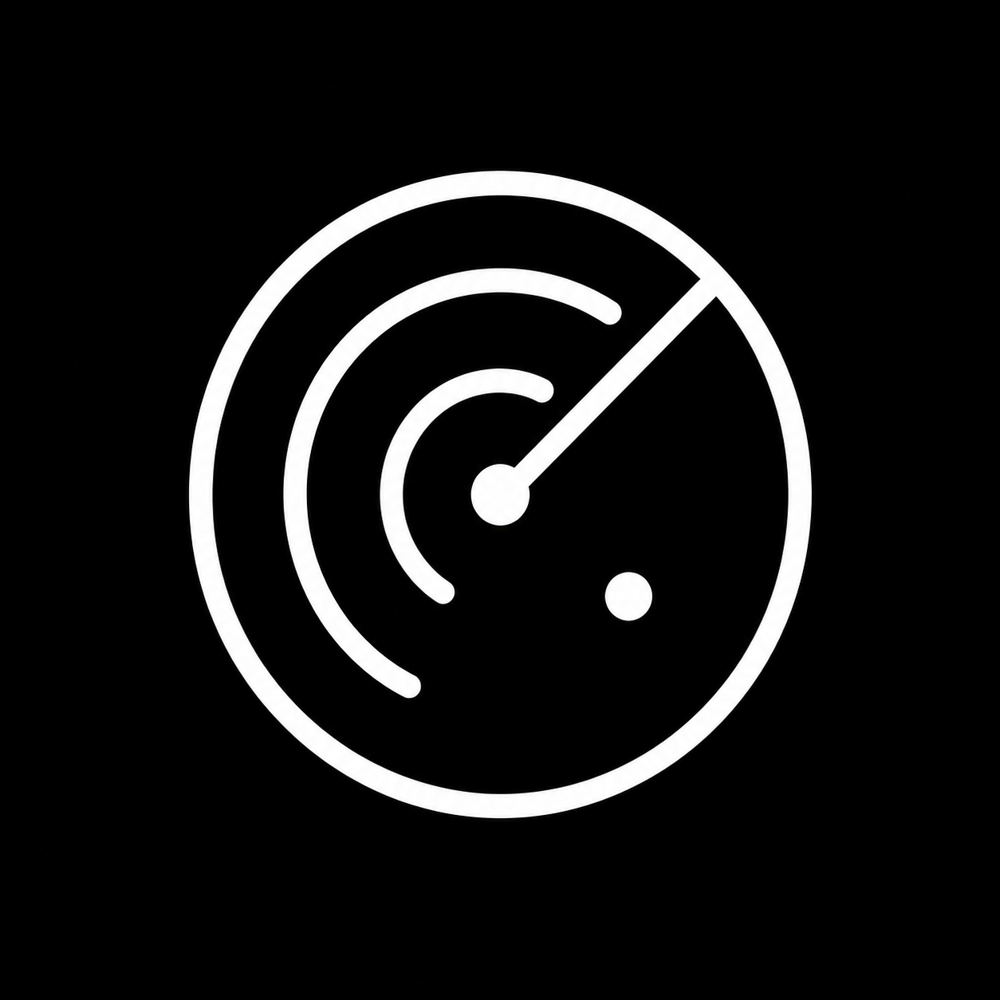

  

# Relay — User Guide

This guide walks through a complete, concrete setup: from creating the Discord bot to seeing media and message notifications live in OBS. For a general overview, see the [README](README.md).

## Table of contents

1. [Create the Discord bot](#1-create-the-discord-bot)
2. [First launch](#2-first-launch)
3. [YouTube Data API key (music)](#3-youtube-data-api-key-music)
4. [Choose the channels](#4-choose-the-channels)
5. [Add the sources in OBS](#5-add-the-sources-in-obs)
6. [Everyday use](#6-everyday-use)
   - [v1.3.6 modules](#v136-modules)
7. [Message notifications](#7-message-notifications)
8. [Moderation](#8-moderation)
9. [On-screen widgets](#9-on-screen-widgets)
10. [Tray & shortcuts](#10-tray--shortcuts)
11. [The /relay command](#11-the-relay-command)
12. [Personalization](#12-personalization)
13. [Troubleshooting](#13-troubleshooting)

---

## 1. Create the Discord bot

1. Open the [Discord Developer Portal](https://discord.com/developers/applications) and click **New Application**. Name it (e.g. *Relay*).
2. In **Bot**, click **Reset Token** and copy the **Token** — you will paste it into Relay. Treat it like a password.
3. Still in **Bot**, enable **Message Content Intent** (under *Privileged Gateway Intents*). Without it the bot cannot read messages.
4. In **General Information**, copy the **Application ID** (this is the *Client ID*).

> The bot only needs to *read* the watched channels. No admin permission, no send-message permission.

## 2. First launch

1. Start **Relay**. The control panel opens.
2. In the **Credentials** section, paste the **Client ID** and the **Token**, then save. Both are stored in the **Windows Credential Manager** — they never touch the disk in plain text.
3. The panel shows an **invite link**: open it to add the bot to your Discord server. It requests only *View Channel* and *Read Message History*.
4. Once the bot connects, the **Status** section shows its name and avatar, the local server state, and how many overlay clients (OBS sources) are connected.

## 3. YouTube Data API key (music)

Music search in Discord needs a **Google Cloud API key** for [YouTube Data API v3](https://developers.google.com/youtube/v3). Relay does **not** use OAuth: you do **not** create a client ID, client secret, or authorized redirect URI.

A shorter English walkthrough also lives in [`docs/youtube-api-setup.md`](docs/youtube-api-setup.md) and in the Relay **Music** panel.

### Create the Google Cloud project

1. Open the [Google Cloud Console](https://console.cloud.google.com/).
2. Sign in with a Google account.
3. Top bar → **Select a project** → **New project**.
4. Name it (e.g. `Relay Music`) → **Create**.
5. Select that project so the top bar shows its name (every later step must stay in this project).

### Enable YouTube Data API v3

1. Open the navigation menu (☰) → **APIs & Services** → **Library**  
   (direct: [API Library](https://console.cloud.google.com/apis/library)).
2. Search for **YouTube Data API v3**.
3. Open it → **Enable**.
4. Wait until the console confirms the API is enabled (you may be redirected to the API overview).

### Create and restrict the API key

1. **APIs & Services** → **Credentials**  
   (direct: [Credentials](https://console.cloud.google.com/apis/credentials)).
2. **+ Create credentials** → **API key**.
3. Copy the key once, then open **Edit API key** (or **Restrict key**).
4. Under **API restrictions**, choose **Restrict key** and select only **YouTube Data API v3**.
5. Under **Application restrictions**, leave **None** for a simple home setup, or use **IP addresses** if you have a stable public IP. Do **not** set HTTP referrers for Relay (it calls Google from the desktop app, not from a website).
6. **Save**.

> Treat the key like a password. Never commit it, paste it in Discord, or share screenshots that show the full value.

### Paste the key into Relay

1. In Relay → **Music**.
2. Paste the key into **YouTube API key** and choose a **Music channel**.
3. Click **Save music settings**. The key field clears afterward: the key is stored in **Windows Credential Manager** and is never shown again.
4. In that Discord channel, type a search (e.g. `jennie seoul city`), pick a result, then choose preview (~30 s) or full track. Relay mixes **relevance** with **newest uploads** (up to 15 tracks ≤ **3 minutes**).

### Quotas and common errors

| Symptom | What to check |
|---|---|
| Bot says the YouTube key is missing / invalid | Key saved in Relay; length/format OK; bot restarted after save |
| Search returns API / quota errors | YouTube Data API v3 enabled on the **same** project as the key; quota not exhausted ([Quotas](https://console.cloud.google.com/apis/api/youtube.googleapis.com/quotas)) |
| `403` / accessNotConfigured | API not enabled, or key restricted to the wrong APIs |
| Empty results for a real song | Query too vague, or only videos longer than 3 minutes matched |

Default free quota is usually enough for personal streaming. Create a **new** key (and delete the old one) if it leaks.

## 4. Choose the channels

On the **Discord** page, under **Channels**, pick the channels:

- **Relay channel** — the channel viewers post into. Text messages appear as visual notifications. Images, GIFs, videos, audio files and stickers go to their outputs. A message with text and media shows the notification first, then each media once.
- **Music channel** *(optional)* — configured on the **Music** page with the YouTube API key ([§3](#3-youtube-data-api-key-music)).

If an earlier version used two different channels for media and messages, the **Channels** section asks which one to keep. Until you choose, each channel keeps its previous role.

Changes apply immediately, no restart needed. Alternatively, a server administrator can run [`/relay channel`](#11-the-relay-command) in Discord.

## 5. Add the sources in OBS

The panel shows ready-to-copy **Browser Source URLs** (Overlay → OBS Browser Sources). They replace the older separate medias / audios / stickers / TTS / notifications / YouTube sources.

| Source | URL | Suggested size | Purpose |
|---|---|---|---|
| **Relay Visual** | `http://localhost:4590/obs/visual` | 1920×1080 | Images, GIFs, videos, stickers, message notification cards, YouTube jukebox |
| **Relay Audio** | `http://127.0.0.1:4590/obs/audio` | 1920×1080 | Discord audio files |
| **Relay Reactions** | `http://127.0.0.1:4590/reactions` | 1920×1080 | Reaction sounds with optional image or GIF |

Use **`localhost`** for Visual (not `127.0.0.1`) so YouTube embeds accept the page Referer. Relay redirects `127.0.0.1/obs/visual` to `localhost` automatically.

In OBS: **Sources → + → Browser**, paste each URL, set width/height, and enable **"Control audio via OBS"** on **both** sources so you can mix Visual (YouTube) and Audio (Discord files) separately.

### Migration from older setups

1. Add the new sources above.
2. Remove the old separate Browser Sources (`/medias`, `/audios`, `/stickers`, `/tts`, `/notifications`, `/youtube`) to avoid double video/audio.
3. Add **Relay Reactions** when the module is enabled. Its page carries the local authorization needed for its sound and library assets.
4. Legacy URLs still work if you need them temporarily.

> **Windows widgets** (media floating widget + notification / Now Playing) stay separate from OBS and are unchanged.

The pages have a transparent background and reconnect automatically if Relay restarts (backoff 1 s → 10 s).

## 6. Everyday use

- **Post media** in the watched channel: up to **3 attachments per message** are relayed. Supported: images (PNG/JPG/WebP), **GIFs** (attachments *and* Tenor/Giphy/KLIPY links), videos, and audio files.
- **Display timing**: static images stay for the *Image duration*, GIFs loop for the *GIF duration*, videos and audio play to the end at the configured *Media volume*.
- **Queue**: media arriving while another is displayed waits in a FIFO queue.
- **Now playing**: audio files with embedded tags show a card with cover art, title and artist.
- **Author badge**: the poster's avatar and name appear with the media (toggleable with *Show author*).
- **Media message**: optionally show up to **180 characters** from the Discord message in OBS, the Windows widget, or both. Standalone links are omitted.
- **History**: the panel lists the last **50** media with **Replay**, and global **Skip** / **Clear overlay** buttons.
- **Skip anywhere**: press **`Ctrl+Alt+S`** even when Relay is not focused. An active reaction is skipped first and its next queued reaction can start; media and music playback stays untouched. When no reaction is active, the shortcut skips the current media item as usual.

### v1.3.6 modules

Relay keeps the three existing areas and adds controls that can be used from the panel.

- **Messages**: select the visible notification and click **Pin** to keep it on screen. Click **Unpin** to remove it and resume queued notifications. Pinning does not stop media, music, or reactions. A pinned message is cleared when Relay restarts.
- **Media library**: click **Import** to copy an image, GIF, or video into Relay's local library. You can also save an item from History. Search, rename, replay, and delete the managed copy from the library. Relay accepts images and GIFs up to **20 MB**, videos up to **50 MB**, and up to **1,000** items. Moving the original file does not affect the copy.
- **Music requests**: the queue lists each waiting title, its requester, and its position. Use **Up**, **Down**, or **Remove** for pending titles; the title currently playing cannot be moved. The default limit is **3 waiting requests per Discord member**. Set it to `0` to disable the limit, or choose `1`–`10`. Duplicate YouTube video IDs already waiting are refused by default. Relay checks these rules together when a request arrives and reports the reason in Discord.
- **Sounds and reactions**: enable the module, import a local sound, and optionally choose an image or GIF from the media library. A reaction can play for at most **30 seconds**. Longer files open the excerpt chooser. Defaults are a **10-second global cooldown**, a **30-second member cooldown**, and music at **25%** of its selected volume while the reaction plays. One reaction plays at a time; up to **25** additional reactions wait in FIFO order. The panel and Discord report whether a reaction starts or waits, including its queue position. A full queue refuses new requests. **Stop reaction and clear queue** stops the active sound and removes every waiting reaction. The local **Test** button plays in the panel and does not send an OBS or Discord event.
- Select allowed channels and roles by name from the dropdown menus. Discord reactions require both an allowed channel and an allowed role. The `/relay reaction` command appears only when the module is enabled. If Discord is offline, saved choices remain available and the refresh button loads their names after reconnection.
- **Protected instructions message (optional)**: paste an existing Discord message link or ID to exempt that message from Relay cleanup. Leave the field empty to protect nothing. Other bots and manual Discord deletions are unaffected.

## 7. Message notifications

Human text messages and emojis posted in the Relay channel appear as visual notifications. Slash commands typed as text, Discord system messages and messages that only contain a GIF link do not create a notification. Messages are not read aloud; Windows voices are no longer used.

- **Character limit**: optionally truncate long text messages.
- **Queue limit**: 1–50 pending messages.
- **Notification card**: enable the OBS notification overlay to show the author and message in Relay Visual for the configured duration. The same card can appear in the Windows notification widget.
- **Notification sound**: the optional custom notification sound remains available independently from message text.

## 8. Moderation

Enable **Moderation** in the panel to hold every incoming media for review before it reaches the stream:

- Pending media (up to 50) appear in the panel's moderation queue with **Approve** / **Reject** buttons.
- **Per-type filters** let you auto-block categories entirely: images (incl. GIFs), videos, audio.
- Disabling moderation clears the pending queue.

Recommended for public channels — nothing goes on stream without your click.

## 9. On-screen widgets

Widgets are transparent, borderless, **always-on-top** windows that show the overlay or the message notifications directly on your desktop — no OBS required (handy for previews or single-PC setups where OBS captures the screen).

- **Media widget** (640×360) and **Notification widget** (640×176), toggled from the panel or the tray. Reactions play through both the OBS source and an invisible Windows audio receiver. The reaction volume controls both outputs.
- **Drag** them anywhere; their position is remembered.
- **Lock** makes a widget click-through (mouse events pass to the window below) — unlock from the panel or tray to move it again.
- Widgets are muted; sound comes from the OBS sources.
- Visible widgets are restored on the next launch.

## 10. Tray & shortcuts

- Closing the main window **does not quit** Relay — it keeps running in the system tray.
- Click the tray icon to open a quick panel: bot/server status, open control panel, show/lock both widgets, quit.
- Only one instance of Relay can run at a time; launching it again focuses the existing one.
- Global shortcut: **`Ctrl+Alt+S`** — skip the currently displayed media.

## 11. The /relay command

Server **administrators** can manage Relay from Discord (replies are ephemeral):

| Command | Effect |
|---|---|
| `/relay channel <#channel>` | Set the Relay channel (messages and media) |
| `/relay show` | Show the current configuration |
| `/relay status` | Show live OBS output, queue, and Windows widget status |
| `/relay test <media\|audio\|notification\|sticker>` | Send an isolated local test to a connected output |
| `/relay reaction <name>` | Trigger an enabled reaction when the channel and member role are allowed |
| `/relay url` | Get the overlay URL (with secret) |
| `/relay regenerate` | Reconnect the local outputs; the overlay URL stays the same |
| `/relay clear <#channel> <count>` | Delete 1 to 1000 recent messages from the chosen channel |
| `/relay nuke <#channel>` | Recreate the chosen channel to delete all of its messages |
| `/relay lock` | Lock or unlock the Relay channel |
| `/relay changelog <#channel>` | Post the latest Relay release notes from GitHub |

## 12. Personalization

In the panel's appearance settings:

- **Theme**: light or dark (true-black, OLED-friendly) — also applied to the window title bar.
- **Accent color**: any RGB color.
- **Font scale**: 80–140 %.
- **Language**: English (US, UK, and India), Français, Deutsch, Español, Español (Latinoamérica), Русский, 简体中文, 한국어, 日本語, and Bahasa Indonesia.

Appearance changes are broadcast live to connected overlays.

## 13. Troubleshooting

**Nothing appears in OBS**
- Check the panel's *Status*: is the bot connected? Is at least one overlay client connected?
- Verify the Browser Source URL matches the one shown in the panel (port included).
- In OBS, right-click the source → *Refresh cache of current page*.

**The bot is online but ignores messages**
- Make sure the **Message Content Intent** is enabled in the Developer Portal.
- Confirm the watched channel is the one you post in, and the bot can see it (*View Channel* + *Read Message History*).
- Messages from bots are ignored by design.

**Message notifications do not appear**
- Check that the Relay channel is set on the **Discord** page. If it asks you to choose between two former channels, pick one.
- Enable the OBS notification overlay or Windows notification widget.
- Check the bot can read the selected channel and that the output is connected.

**Port already in use**
- Change the port in the panel (≥ 1024). Connected overlays follow the move automatically; update your OBS URLs if they don't reconnect.

**Overlay URL shows "401"**
- The `/overlay` page requires the secret. Prefer the panel’s **Relay Visual** / **Relay Audio** URLs (`/obs/visual`, `/obs/audio`). Legacy short URLs (`/medias`, `/audios`, `/youtube`, `/notifications`, `/stickers`) still work. The former `/tts` page has been removed.

**A media is stuck on screen**
- Press **`Ctrl+Alt+S`** or click **Skip** / **Clear overlay** in the panel.

**A pinned message does not disappear**
- Open the **Messages** module and click **Unpin**. The pinned card is removed and queued notifications can continue. Pinning survives until it is explicitly removed or Relay restarts.

**A music request is refused**
- Check the Music module's per-member pending limit and whether the same YouTube video is already waiting. A limit of `0` disables only the per-member limit; duplicate protection has its own switch.

**A reaction does not trigger**
- Confirm the module is enabled, the reaction is enabled, and its sound file still exists.
- Confirm the Discord command is used in an allowed channel by a member with an allowed role. Both lists must match.
- Connect the **Relay Reactions** Browser Source. The local Test button does not check Discord access and does not send the reaction to OBS.

**Music search fails in Discord**
- Confirm a **YouTube API key** is saved under **Music** ([§3](#3-youtube-data-api-key-music)).
- Confirm **YouTube Data API v3** is enabled on the same Google Cloud project as that key.
- Confirm a **Music channel** is selected and you are typing in that channel.
- English step-by-step: [`docs/youtube-api-setup.md`](docs/youtube-api-setup.md).
